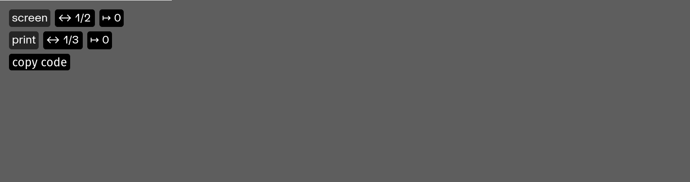

## Figures et annexes

Les annexes (_template_ `appendices`) et les sections iconographiques (_template_ `figures`) sont organisées sur une grille de 12 colonnes.

### Dimensions et mise en page des figures et des images 

On peut ajouter au code d’insertion d’une image des attributs `width`, `prinwidth`, `col` et `printcol` qui permettront de déterminer la largeur et la position (colonne) d’affichage de l’image.

Par défaut, chaque image ou figure occupe 3 colonnes.

```pttp
(image: images/fichier.jpg width:8 printwidth:4)
```
↑ Cette image occupera 8 colonnes en version écran et 4 colonnes en version _print_.

```pttp
(image: images/fichier.jpg width:8 col:5)
```
↑ Cette image occupera 3 colonnes (par défaut) en version _print_, 8 colonnes en version écran et sera décalée (à l’écran) en 5<sup>e</sup> colonne.


### Mise en page visuelle des images

Pour aider à la mise en page “visuelle” des images, on peut activer un utilitaire qui aide à déterminer le code d’intégration des images.

En contexte écran, ajouter `/?layout` à l’URL.   
En contexte de prévisualisation print : `/?print&layout`.   

On peut alors cliquer sur chaque figure pour faire apparaitre un outil d’édition :



Cet outil permet de définir la largeur de la figure (de 3 à 12) et son décalage (auto, ou de 1 à 9). 

⚠️ Le code d’intégration de la figure est alors automatiquement copié dans le presse-papier, et doit être collé dans le document markdown source. 

⚠️ Attention, en contexte d’impression, la mise en page n’est pas recalculée. Il faut copier/coller le nouveau code d’intégration dans le fichier markdown, enregistrer ce dernier, puis actualiser la page dans le navigateur.

### Breaking changes

_Avant_ la version « Figures » de PageTypeToPrint (18 janvier 2024), les options de largeur et de décalage étaient déterminées grâce à des `class` prédéfinies :

* `offset0` : pas de décalage (valeur par défaut)
* `offset2` décale l’image en colonne 3
* `offset4` décale l’image en colonne 5
* `offset6` décale l’image en colonne 7
* `offset8` décale l’image en colonne 9
* `quarter` dimensionne l’image sur 3 colonnes (un quart de la largeur — valeur par défaut)
* `third` dimensionne l’image sur 4 colonnes (un tiers de la largeur)
* `half` dimensionne l’image sur 6 colonnes (la moitié de la largeur)
* `twothird` dimensionne l’image sur 8 colonnes (deux tiers de la largeur)
* `threequarter` dimensionne l’image sur 9 colonnes (trois quarts de la largeur)
* `full` dimensionne l’image sur 12 colonnes (toute la largeur)

Par exemple :
```pttp
(figure: url/de_limage.jpg class: notwhite offset6 half) 
```