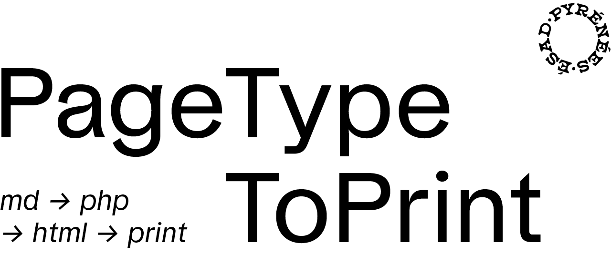

PageTypeToPrint est un gabarit destiné à la mise en forme normalisée d’un document écrit de DNA ou d’un mémoire de DNSEP. Il est conçu avec comme hypothèse principale la simplicité de l’édition (contenu textuel au format *markdown*), mais peut être adapté, augmenté et personnalisé.

Il produit un contenu lisible en ligne sous la forme d’une page web et permet de générer un document PDF téléchargeable et imprimable.

## Démo

Une démo est accessible en ligne sur [ateliers.esad-pyrenees.fr/pagetypetoprint](https://ateliers.esad-pyrenees.fr/pagetypetoprint/) avec sa version [_print_](https://ateliers.esad-pyrenees.fr/pagetypetoprint/?print) et le [document pdf](https://ateliers.esad-pyrenees.fr/pagetypetoprint/document.pdf) généré. 

## Documentation

* [Installation](installation.md)
* [Configuration et contenu](contenu.md)
* [Gabarits](gabarits.md)
* [Contenu au format markdown](markdown.md)
* [Version imprimable / téléchargeable](print.md)
* Composition    
    * [Sommaire](sommaire.md)
    * [Images et vidéos](images.md)
    * [Annexes](appendices.md)
    * [Glossaire](glossaire.md)
    * [Entretiens](entretiens.md)
    * [Références et bibliographie](references.md)
    * [Micro-typographie](microtypo.md)
    * [Notes](notes.md)
* [Mise en ligne](online.md)

## Aller plus loin

* [Étendre et détourner l’outil](extend.md)